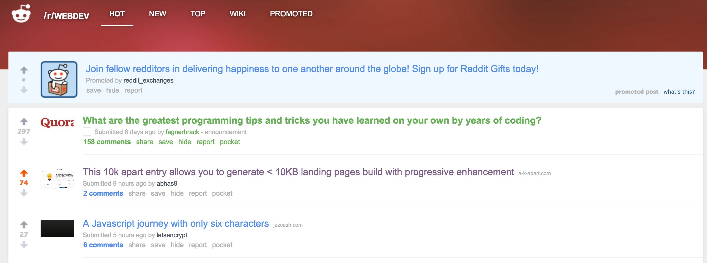

# IdeaDeck
Landing page generator with a focus on performance, accessibility and minimal design build with progressive enhancement principles. The project is build as part of the 10kApart challenge. All pages are below 10 KB limit (including the three sample landing pages in the gallery).

## Demo
[https://ideadeck-10kapart2016.azurewebsites.net/ (https://ideadeck-10kapart2016.azurewebsites.net/)

## Use cases
* Showcase your website or app.
* Sell products using `PayPal`.
* Collect donations via `PayPal`.

## Features
* Social sharing widget (`Tweet` and `Facebook Share` are supported as of now).
* Subscribe widget: Get a mail when someone subscribes to your landing page - powered by `formspree.io`.
* Buzzwords/highlights section: Tell your audience some key features of your offering.
* Carousel of images: when more than one image has to be shown.

## Performance
* Generated landing pages are compiled as `HTML` and are served as static content without any database dependencies. For maintainability, we also persist the content of landing page as `JSON` which can be used later to update the landing pages if we change the template.
* Template minification using `gulp-selectors` & `gulp-minifier` to compress `HTML` & `CSS` including the class names.
* `JavaScript` is embedded in `HTML` to prevent extra network call.
* `JavaScript` is `uglified` using `jstransformer-uglify-js` in the `jade` template itself.
* Landing pages are compiled from a `jade` template that makes sure that they only contain the required `JavaScript` and `CSS`. - Carousel `JavaScript` and `CSS` are included only if the user chooses to have more than one image on the landing page.
* `gzip` for compression.
* Optimizing images:
  * Photoshop’s `Save for Web tool`.
  * Next, we have used `https://tinyjpg.com/` which gave us additional 20%-30% gain without any visible loss in quality.
  * Icons used in the gallery are saved as `GIF` in 8-bit color code.
  * `Photo` in sample landing page `/abhas_tandon` was optimized using the blur technique described By [Aaron Gustafson](https://blogs.windows.com/msedgedev/author/aaron-gustafson/), [Anton Molleda](https://blogs.windows.com/msedgedev/author/anton-molleda/) and [David García](https://blogs.windows.com/msedgedev/author/david-garcia/) in this [Microsoft Edge Developer blog post] (https://blogs.windows.com/msedgedev/2016/09/23/10k-compilation-optimization-compression/#B6fXFvUuHWdGtiQ0.97)
* Use of non-boring web safe font stack.
* Use of three-letter color codes wherever possible.

## Accessibility
* Meaningful Markup structure and semantics. `<header>, <footer>, <h1> and <ul>` for semantic equivalence.
* Color adjustments for `WCAG Level AA` color contrast, as beautifully described in this [blog post](https://blogs.windows.com/msedgedev/2016/09/06/10k-for-optimization-performance/#GUqGsqpQBLIPbQPx.97) by [Stephanie Stimac](https://blogs.windows.com/msedgedev/author/stephanie-stimac/)
* Associated form labels with controls.
* `area-invalid` & `aria-describedby` used in the form wherever necessary.
* Managed `autocorrection` and `spellcheck` in the form using proper attributes.
* All required fields indicated using `HTML5` attribute.
* Suggestive `placeholder`s used for all input fields.
* Right field types used for `email`, `url` & `number` in input fields.
* Proper error messages in form.

## Progressive enhancement
* Designed with "no style" and "default style" scenarios in mind. Markup tested in `Lynx`.
* Forms can work without `JavaScript` using server side rendering. If `JavaScript` is available, `AJAX` is used to enhance the experience.
* Generated landing pages containing multiple images, displays them in a `div` with horizontal scroll. If `JavaScript` is available, images are displayed as a `carousel` with `next` and `previous` controls.
* Gallery page (`/gallery`) displays just the sample page names with a short description. If `JavaScript` is available, we go ahead and lazy load the required images.
* Tweaks in the main Landing page
  * Default to text slogan when no `JavaScript` is available.
  * If `JavaScript` is available, we try to lazy load our `SVG` logo first with a fallback to `PNG` in order to support older browsers.
* Fallback using CSS fault tolerance technique as described by [Aaron Gustafson](https://blogs.windows.com/msedgedev/author/aaron-gustafson/) in this [blog post] (https://blogs.windows.com/msedgedev/2016/09/08/10k-css-structure-and-sandboxing/#5Zi77IEakhRWYvmw.97)
  * Using `:-o-prefocus` to fallback to `position:relative` in `Opera mini`.

## Design for landing pages
* Minimal design which encourages users to click `call to action` buttons using several techniques described in [InstaPages blog](https://instapage.com/blog) and several other sources.
* Designed for small screen first.

## Future work
* Use `Sass` for modular `CSS`.
* Integrate other payment channels.

## Contributors
* [Abhas Tandon](https://github.com/abhas9)
* [Sandeep RV](https://github.com/sandeeprv)
* [Shashi Shekhar](https://github.com/shashi20008)
* Special Thanks to [thefourtheye](https://github.com/thefourtheye) for code review.

## Development

### Build
* `npm install`
* `./node_modules/.bin/gulp`

### Start
* `npm start`

### Contributing
We are open to all feedbacks, suggestions, and improvements. You can help us in different ways:
  * [Open an issue](https://github.com/abhas9/ideadeck/issues) with suggestions for improvements.
  * Fork this repository and submit a pull request.
  
## Thanks for all your love Reddit

